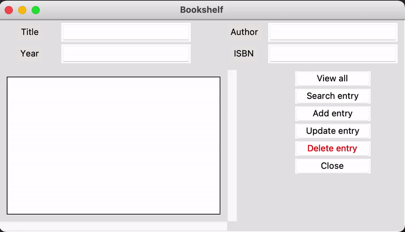

# python_GUI_BookShelf_DB_OOPv
python Tkinter GUI and SQLite DB to store books by title, author, year, isbn
  

  
### To run:
`python3 app.py`  

#### To make an executable: 
`pip3 install pipinstaller`  
`pipinstaller <NAME OF MAIN .py FILE>`  

#### If does not work
`brew install platypus` for platypus's comand-line tools  
`brew cask install platypus` for platypus's GUI  

## Notes:
Program that stores book information  
Title ,  
Author ,  
Year ,   
ISBN  

User can:  
- View all records  
- Search all entries  
- Add entry  
- Update Entry  
- Delete  
- Close  
